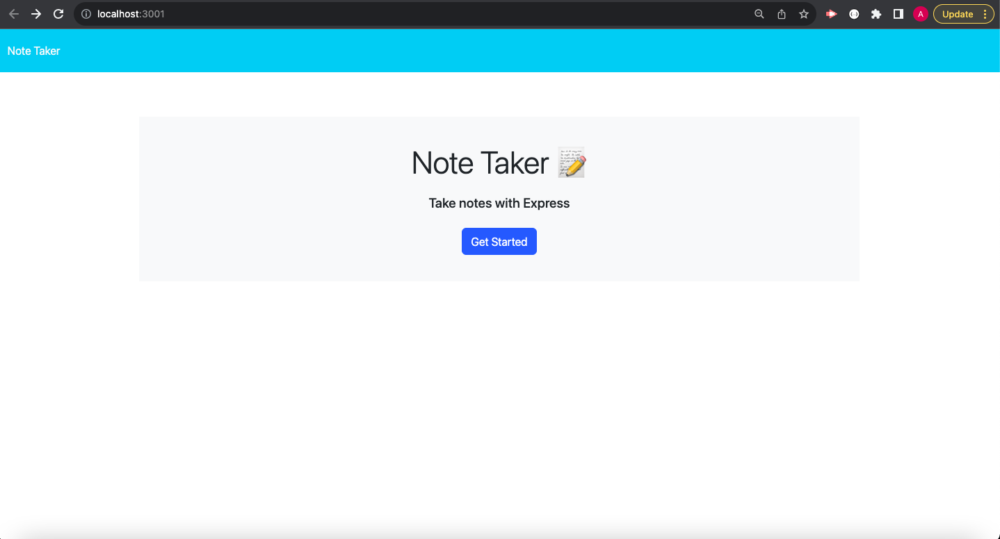
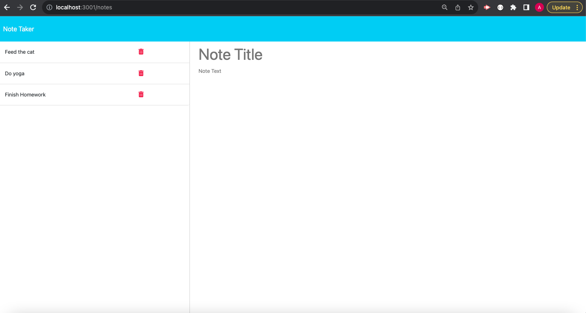

# Express Note Taker

  ## Desctription
  Provide a short description explaining the what, why, and how of your project. Use the following questions as a guide:

  This is a note taking application that was made using the Express Node web framework. The functionality of this page should allow a user to write and save notes as well as delete them. These notes will be saved and retrieved from a JSON file. 

  ## Table of Contents
  * [Installation](#Installation)
  * [Usage](#Usage)
  * [Built With](#BuiltWith)
  * [Screenshots](#Screenshots)
  * [Questions](#Questions)

  ## Installation
  What are the steps required to install your project? Provide a step-by-step description of how to get the development environment running.

  Clone Project in GitHub, Run npm i to retrieve all necessary packages

  ## Usage
  Provide instructions and examples for use. Include screenshots as needed.

  After packages are installed, run node server.js in the terminal or npx nodemon server.js to run the server and the page will be found on localhost:3001

  ## Built With
  * HTML
  * CSS
  * JavaScript
  * Node.js
  * Express
  * uuid

  ## Screenshots

  ## Questions

  If you have any questions about this application, please reach out to me via email at alexpurfield@gmail.com. You can view my GitHub at https://github.com/alexpurfield

